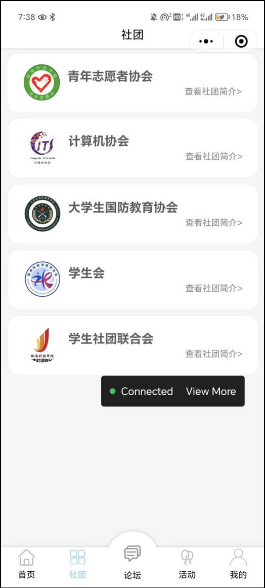
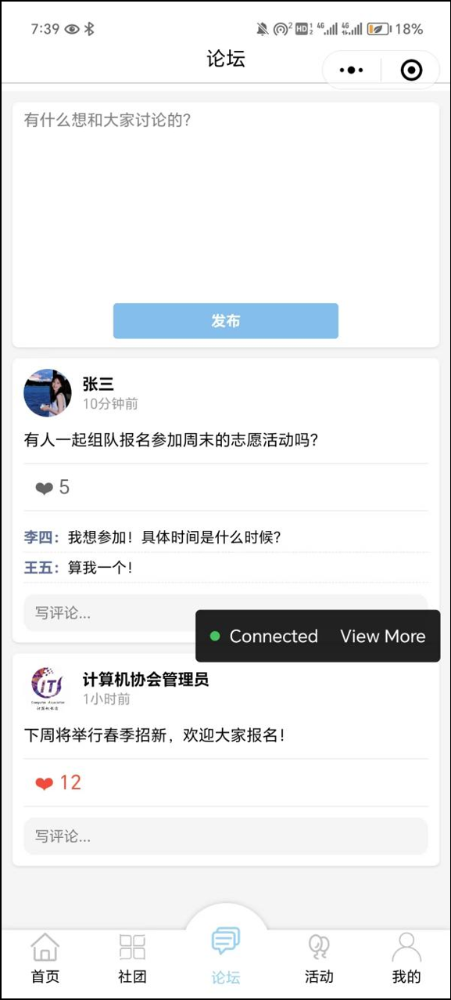
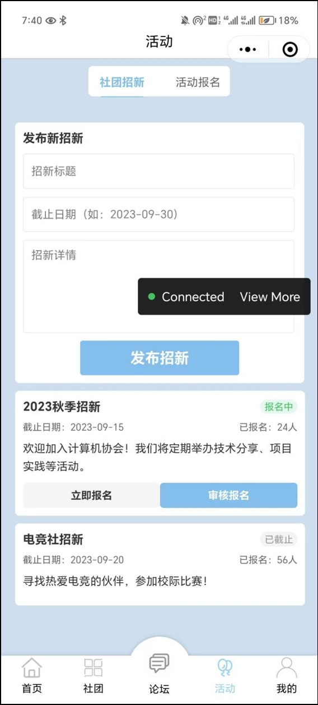
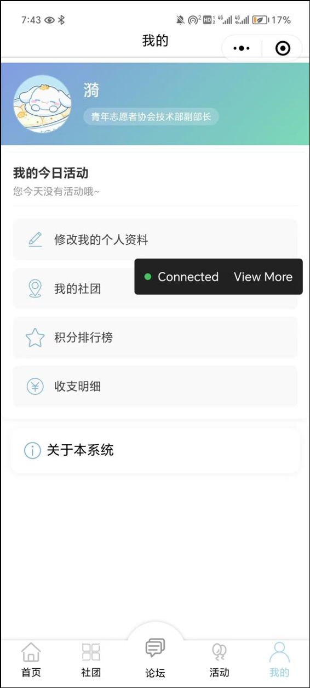

# 校园社团活动管理系统微信小程序的设计与实现

这是一款校园社团活动管理系统，用于高校社团协会全面管理社团事务。

## 开发工具

- 微信开发者工具

## 项目结构

```
ClubHub_System/
├── components/
│   ├── Header/
│   ├── Header_return/
│   └── Navigation/    
├── pages/
│   ├── activity/
│   ├── elegance/
│   ├── Forum/
│   ├── Homepage/
│   ├── icon/
│   ├── index/
│   ├── it/
│   ├── login/
│   ├── logs/
│   ├── Material/
│   ├── me/
│   ├── my/
│   ├── n/
│   ├── notice/
│   ├── notice_c/
│   ├── notice_q/
│   ├── points/
│   ├── q/
│   ├── Sort/
│   ├── Statement/
│   ├── System/
│   ├── xsh/
│   └── xsl/
├── utils/
│   └── util
├── .eslintrc.js
├── app.js
├── app.json
├── app.wxss
├── project.config.json
├── project.private.config.json
├── sitemap.json
└── README.md
```

## 申优答辩视频

- https://www.bilibili.com/video/BV1upEszJEQt/?spm_id_from=333.337.search-card.all.click


## 页面运行效果

- 
- 
- 
- 
- 
- 
